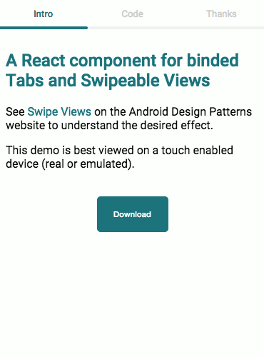

# React Swipe Views

A React component for binded Tabs and Swipeable Views

See [Swipe Views](http://developer.android.com/design/patterns/swipe-views.html) on the Android Design Patterns website for inspiration.

Works with [React Router](https://github.com/rackt/react-router), as a pure component or as a standalone component.

## Demo



## Quick Example

```jsx
'use strict';

import React from 'react';
import SwipeViews from 'react-swipe-views';

export default class App extends React.Component {
  render() {
    return (
      <SwipeViews>
        <div title="Tab 1">
          Page 1
        </div>
        <div title="Tab 2">
          Page 2
        </div>
        <div title="Tab 3">
          Page 3
        </div>
      </SwipeViews>
    );
  }
}
```

## Install

This component is available as an npm module or a bower component:

```
npm install react-swipe-views --save
```

or

```
bower install react-swipe-views --save
```

## Examples

There are two example projects in the [/examples](examples) folder. One is using the npm module and webpack as a build tool with react-router, the other uses bower and brunch as a pure component.

## TODO List

- Allow for content to be inserted in the header
- Write tests

## Thanks

- [David Bruant](https://twitter.com/davidbruant) for making me believe in JavaScript
- [React](http://facebook.github.io/react/) for being awesome
- [Babel](http://babeljs.io/) for removing so much pain from transpiling/compiling/bundling
- [Dan Abramov](https://github.com/gaearon) for all the useful ressources, in this case [React Hot Boilerplate](https://github.com/gaearon/react-hot-boilerplate)
- [Hassan Hayat](https://github.com/TheSeamau5)'s [Swipe Pages WebComponent](https://github.com/TheSeamau5/swipe-pages) for inspiration
- [Ferran Negre](https://github.com/ferrannp) for helping me debug

## License

MIT